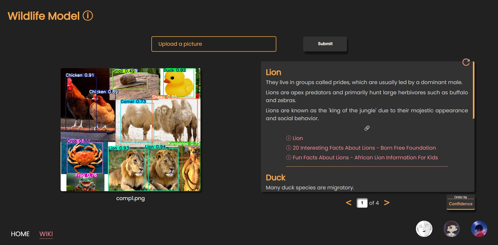

<a name="readme-top"></a>

# StatML - YOLO-based Object Detection Application

-   Final project from HCMUS's 2024 Statistical Machine Learning course.

<div align="center">
    
    
</div>
<div align="center">
    
    
</div>

## Getting Started

### Prerequisites

-   Windows 10 or 11.
-   [Python](https://www.python.org/downloads/) >= 3.11.
-   [CUDA Toolkit](https://developer.nvidia.com/cuda-downloads) >= 12.6.

    -   Check [GPU compatibility](https://developer.nvidia.com/cuda-gpus) first.

-   [Pytorch](https://pytorch.org/) with CUDA computation.

-   _(Optional)_ Any decent code editor, preferably [VSCode](https://code.visualstudio.com/), and [Jupyter package](https://pypi.org/project/jupyter/).

### Installation

1. Clone the repo.

    ```console
    https://github.com/kru01/StatML_YOLO.git
    ```

1. Install dependencies.

    ```python
    pip install -r requirements.txt
    ```

    1. It is highly advisable to work with a [`venv`](https://docs.python.org/3/library/venv.html) to avoid issues.
    1. Make sure `CUDA` is available before creating any `venv`, and then `Pytorch with CUDA` should be manually installed, before getting the rest of dependencies.
        1. Otherwise, [errors](https://youtu.be/d_jBX7OrptI?si=QhOhBIExe0lmb83i&t=76) might occur.

### Usage

#### To work with the website

```python
py .\src\app.py
```

-   Because of [a conflict between APScheduler and Flask's reloader](https://stackoverflow.com/a/15491587), the reloader is disabled. Consider not enabling the scheduler, in exchange for auto-reloading during development.

#### To tinker with YOLO and train models

-   Navigate to [modelTraining](modelTraining).

## Meet The Team

<div align="center">
  <a href="https://github.com/phongan1x5"></a>&nbsp;&nbsp;&nbsp;
  <a href="https://github.com/kru01"></a>&nbsp;&nbsp;&nbsp;
  <a href="https://github.com/TGHuybu"></a>&nbsp;&nbsp;&nbsp;
</div>

<p align="right">(<a href="#readme-top">back to top</a>)</p>
